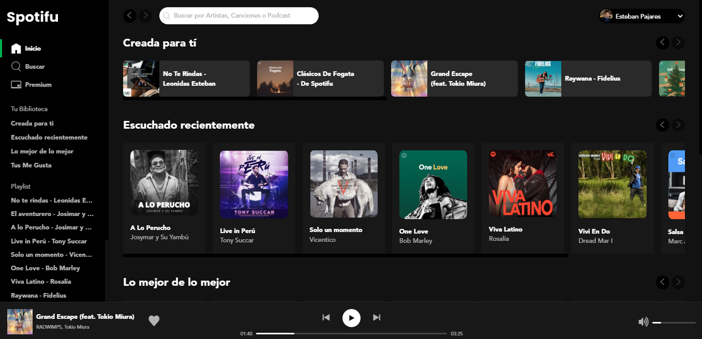
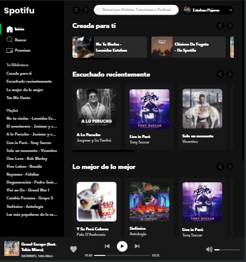

# spotifu

Project spotifu, implemented from a design in Figma: [course of Flexbox Layout and Components](https://leonidasesteban.com/cursos/flexbox-componentes)

## Desktop

## Mobile

### Links
- [Website](https://estebanpajares.github.io/spotifu/)
- [Project spotifu](https://leonidasesteban.com/proyectos/spotifu)

## Technologies

- HTML
- CSS
- Responsive Design
- Flexbox & Components.
- Accesibility
